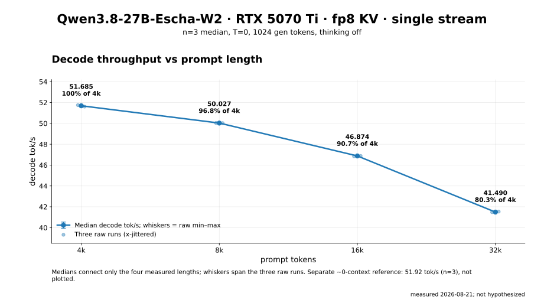
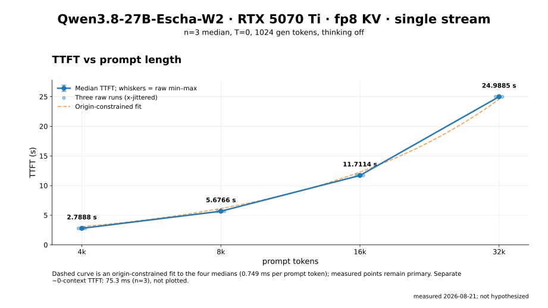
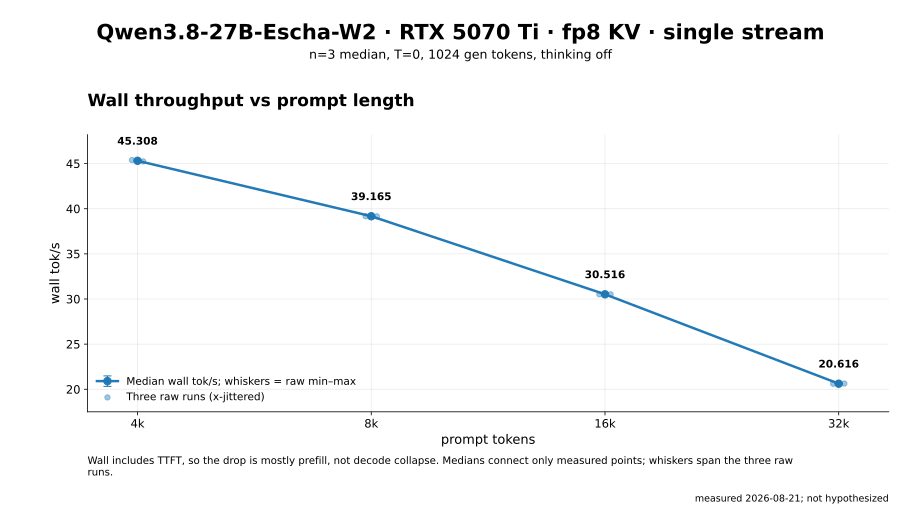
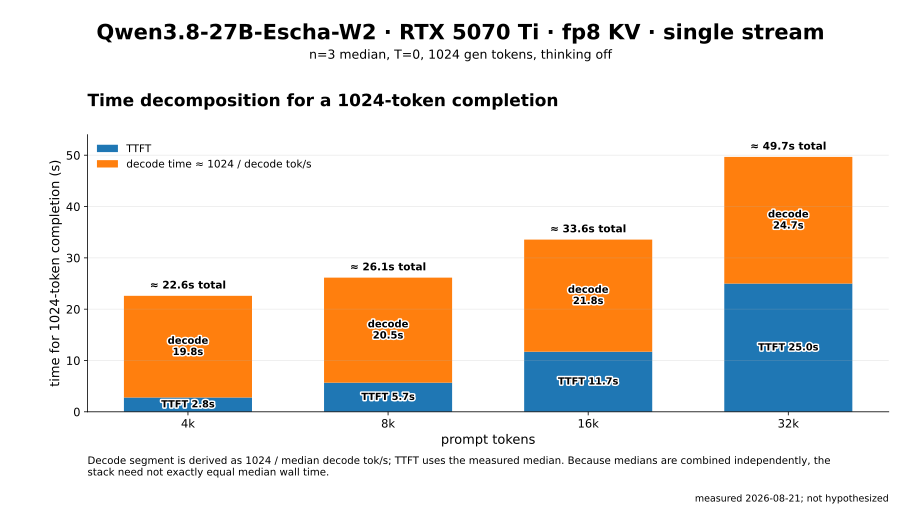

# Qwen3.8-27B-Escha-W2 on 1× RTX 5070 Ti 16 GB

This repository is a reproducible single-stream serving recipe for
[`EschaLabs/Qwen3.8-27B-Escha-W2`](https://huggingface.co/EschaLabs/Qwen3.8-27B-Escha-W2)
on exactly one NVIDIA RTX 5070 Ti 16 GB (`sm_120`). It is not a general
Blackwell recipe and does not claim a universal fastest result.

The official model card's 16 GB row was untested. Use the numbers here, not
that row. The engine is **not** stock SGLang, vLLM, or llama.cpp. Only the
`EschaLabs/escha-runtime-qwen3dense` wheel (`escha-1.1.0+qwen3dense`, bundled
SGLang `0.5.15.post1`) loads these 2-bit `escha` weights.

## Requirements and pinned identity

- Exactly 1× RTX 5070 Ti 16 GB, consumer Blackwell (`sm_120`).
- Python 3.12, pip, and `hf`.
- A local checkpoint directory of `EschaLabs/Qwen3.8-27B-Escha-W2`
  (**10,153,088,224 bytes** of weights).
- Runtime: `torch==2.9.*` from the CUDA 12.8 index **first**, then the
  `escha-runtime-qwen3dense` wheel. Measured stack: `torch 2.9.1+cu128`,
  `escha-1.1.0+qwen3dense`, SGLang `0.5.15.post1`.
- Official `serve.sh` from that runtime. Extra flags go through `"$@"` to
  `sglang.launch_server`.

## Install

Python **3.12** venv. Install CUDA 12.8 torch 2.9 **first**, then the escha
wheel. Reverse the order and the ABI breaks. Do not install stock `sglang`
from PyPI.

Set `VENV` and `MODEL` yourself. There are no home-directory defaults.

```bash
python3.12 -m venv "$VENV" && source "$VENV/bin/activate"
pip install -U pip wheel
pip install "torch==2.9.*" --index-url https://download.pytorch.org/whl/cu128

pip install -U "huggingface_hub[cli]"
hf download EschaLabs/escha-runtime-qwen3dense --include "sglang/*" --local-dir runtime
pip install ./runtime/sglang/escha-*.whl

hf download EschaLabs/Qwen3.8-27B-Escha-W2 --local-dir "$MODEL"
```

Sanity check before serving — all three must print `True`, and
`escha.__version__` must be `1.1.0+qwen3dense`:

```bash
python -c "import torch, escha, sglang; print(torch.__version__, escha.__version__, sglang.__version__); print(torch.cuda.is_available(), hasattr(torch.ops.escha, 'escham_decode_gemv'), bool(sglang.__version__))"
```

## Launch (adopted settings)

Required on this card:

- `ATTN_BACKEND=triton` (consumer Blackwell / `sm_120`; flashinfer fails on
  this hybrid)
- `THINK=0` (latency measurement and low-latency serve; do not turn thinking
  back on to chase a complete answer)
- `GRAPHS=1`
- `RADIX=0`
- `DETERMINISTIC=0` (`DETERMINISTIC=1` fails to boot on `sm_120`)
- `--kv-cache-dtype fp8_e5m2` (full-attention is **16 layers only**; the
  mamba pool stays fp16). This flag is not an env var; pass it through
  `serve.sh`'s leftover `"$@"` slot.

Single-user: `CUDA_GRAPH_BS=1` `MAXREQ=1` `MAXMAMBA=1`. `INT8=on`.
`MEM=0.90` `CTXLEN=65536`. OpenAI-compatible endpoint:
`http://127.0.0.1:30000/v1`. Served name is `SERVED_NAME` (default
`escha-qwen38-27b-w2`).

```bash
export ATTN_BACKEND=triton
export THINK=0
export GRAPHS=1
export RADIX=0
export DETERMINISTIC=0
export MEM=0.90
export CTXLEN=65536
export CUDA_GRAPH_BS=1
export MAXREQ=1
export MAXMAMBA=1
export INT8=on

MODEL="$MODEL" VENV="$VENV" bash runtime/sglang/serve.sh --kv-cache-dtype fp8_e5m2
```

## Display GPU: leave headroom

This 5070 Ti is a **16 GB display GPU**. At adopted `MEM=0.90`, idle serve
leaves about **1.2 GB** free. Do not raise `MEM` to steal that margin; the
compositor can die. `MEM=0.92` is unmeasured.

If the box has more than one GPU, pin the 16 GB card with
`CUDA_VISIBLE_DEVICES` yourself. This recipe does not ship a UUID or PCI
bus id.

## What not to use

| Do not | Why |
|---|---|
| stock vLLM / stock SGLang / llama.cpp | These `escha` 2-bit weights do not load. The measured engine is escha-runtime only. |
| speculative decoding (MTP / EAGLE) | This checkpoint has no draft weights. |
| NGRAM spec | Crashes on this hybrid GDN. |
| `DETERMINISTIC=1` | Boot failure on `sm_120`. |
| empty `ATTN_BACKEND` | Triton is required on consumer Blackwell. |
| `MEM=0.92` or higher | Unmeasured. Cuts into the ~1.2 GB display-GPU free margin. |

## Measured reference (not a fastest-winner claim)

Same-condition, thinking off, no spec, temperature 0. Numbers are measured
only. `MEM` and FP8 KV do **not** move single-stream tok/s; they move pool
size and free VRAM.

### Short prompt (n=3)

Tiny prompt, thinking off: **~51.9 tok/s**, TTFT **~75 ms**.

### FP8 KV `MEM` sweep

`--kv-cache-dtype fp8_e5m2`. `pool` is startup `max_total_num_tokens`.

| `MEM` | pool (`max_total_num_tokens`) |
|---|---:|
| 0.85 | 37751 |
| 0.88 | 50963 |
| **0.90 (adopted)** | **60875** |
| 0.92 | unmeasured |

Adopted `MEM=0.90` idle serve leaves ~1.2 GB free. Pool at that setting is
60875 tokens (startup-to-startup range observed ~59629–60875).

### Context length vs speed (n=3)

`max_tokens=1024`, thinking off, spec off. Decode / wall are tok/s. TTFT
is seconds.

| prompt tokens | decode tok/s | wall tok/s | TTFT |
|---:|---:|---:|---:|
| 4096 | 51.685 | 45.308 | 2.7888 s |
| 8192 | 50.027 | 39.165 | 5.6766 s |
| 16384 | 46.874 | 30.516 | 11.7114 s |
| 32768 | 41.490 | 20.616 | 24.9885 s |

Same-condition charts:

- 
- 
- 
- 

## License and attribution

This recipe documents third-party weights and a third-party runtime. It does
not redistribute either. Model terms:
[EschaLabs/Qwen3.8-27B-Escha-W2](https://huggingface.co/EschaLabs/Qwen3.8-27B-Escha-W2)
(Apache-2.0). Runtime terms:
[EschaLabs/escha-runtime-qwen3dense](https://huggingface.co/EschaLabs/escha-runtime-qwen3dense)
(Apache-2.0). Repository-authored documentation is for this measured 5070 Ti
configuration only.

Author: Hikari / [hikarioyama](https://github.com/hikarioyama)
